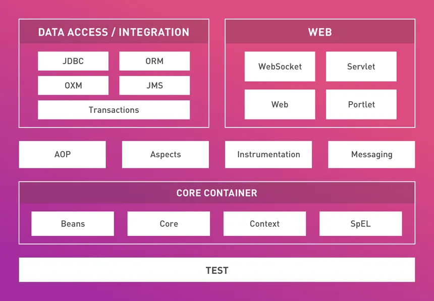
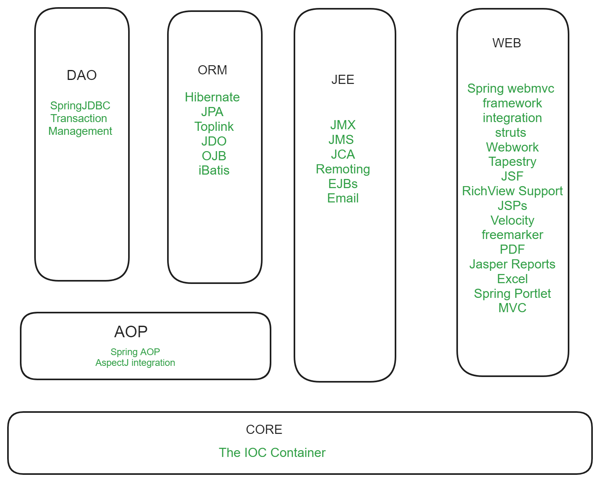
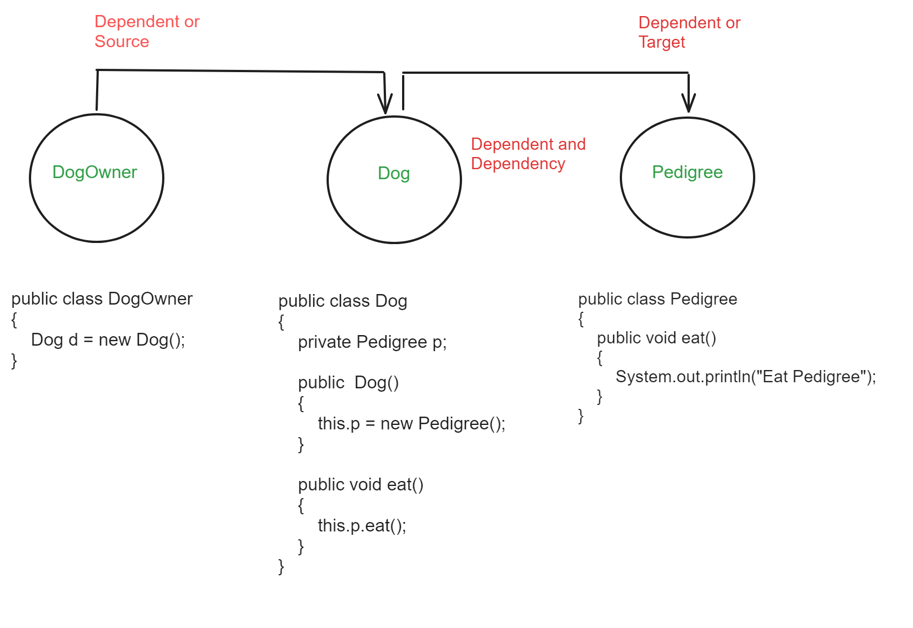
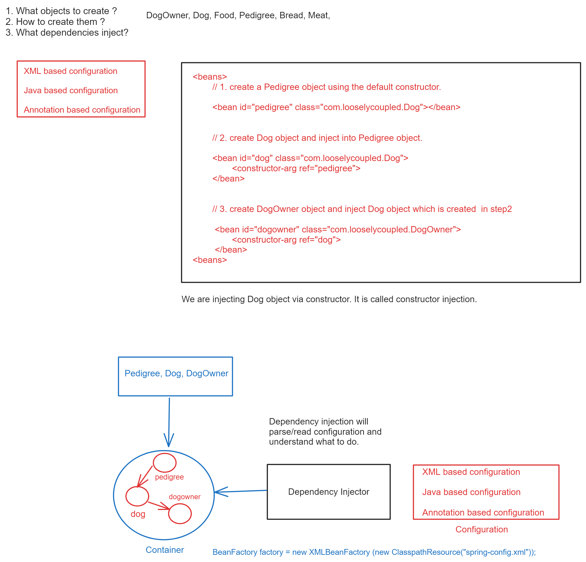
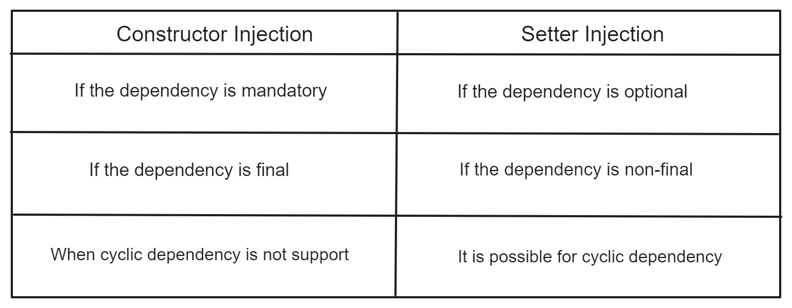
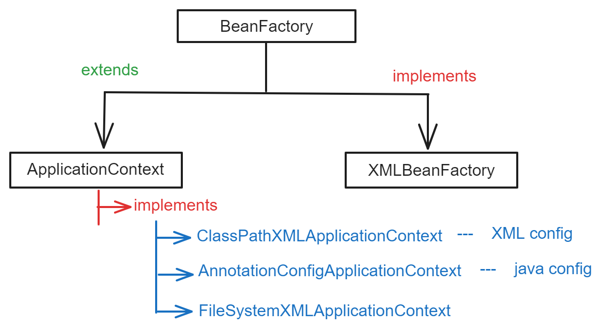
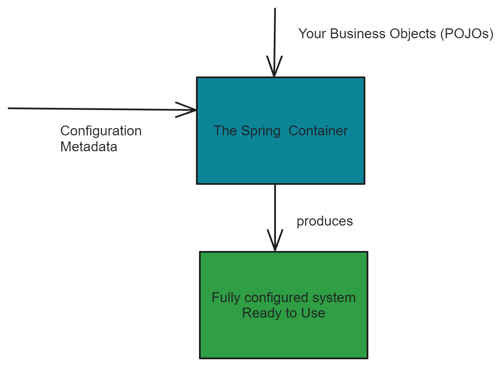

# SpringCore
__________________________________________


### What is a Spring framework?

 - Spring is an open source framework for building standalone and enterprise java application.
 - It was an initial release of spring in 2003
 - It is developed by Rod Johnson.
 


### Why is spring introduced into the market?

 - "The main goal of spring framework is to make J2EE application development easier."
 - J2EE: Servlet, JSP, RMI, EJB, etc...

### Drawbacks of J2EE
 
 1. **Tightly Coupling** : Application should extend servlet, EJB, etc.

 2. **Heavy Weight** : Application startup will take more extra processing time.

 3. **BoilerPlate Code** : Common code is getting repeated in multiple places todo some activity.

 4. **Cross-Cutting Concerns** : Doesn't support security, transaction inbuilt, need to implement manually.
---
### lemon terms

#### 1. Tightly coupling :
 - If you want to write any simple hello world servlet, we should be extended your http in servlet or actual servlet interface implementation its tightly coupling tomorrow if you want to migrate from your servlet to any other technologies we can't do it. we have to write so much amount of code.   

 - Application class should be extended with other class. Our Applications should extend servlet, EJB and so on. whenever you are okay, extending your servlets or EJB, you have to override your init() method, service(); EJB will predefine methods so that tomorrow. If you want to migrate from EJB to any other framework, you can't do it.

#### 2. Heavy weight : 
 - All the J2EE applications are heavyweight. 
 - If any guys working, they are able to know in 2010. It will take time to load the application at least 15 minutes. So many classes and framework delegated classes, so many our app server classes will take so much time. Application startup will take more extra processing time. 
 

#### To overcome all this problem. One of the persons from J2EE team is that person name is Rod Johnson this person also be a part of this J2EE project team.
#### What did this person?
- Because of all these drawbacks of J2EE application. There is a person name called Rod Johnson. He is from sun micro-system. He came out from Sun Microsystem and very disappointed with J2EE features, and he was started his company name called Interface21.
- Later Interface21 was renamed as 'Spring'

---
#### Advantages of Spring Framework

1. Make application development easier.
2. **Light Weight** : Startup time is very less.
3. **Spring has modularity** : 20 modularity spring core, mvc, batch, transaction, security, boot, webmvc, Dao, AOP, etc... 
4. **PoJo Development** : Spring doesn't force your application to extend or implement any spring framework class.
5. **Popular** : Loosely coupled and unit test code.

#### Why is Spring sustained in the market?
- Because spring gives ready sample code of any framework like 
  Spring Redis—Redis Cache 
  Mongo Template—MongoDB— 
- Kafka, JMS   


   
  
#### SOLID Principle 

- SRP = Single Responsibility Principle.
- class = User details + customer details.  Wrong 
- class = Either user details or customer details. Right
- class should follow single responsibility.
- Every class should have a single responsibility

- Every project would have multiple classes if we follow SRP(Single Responsibility Principle)
- Every class developer should create the object.
- When an application is running, these objects should interact with another object.

```java

    class B
    {
      amount()
      {
    
      }
    } 

   class A
   {
       B b;
       m1()
       {
           
       }   
   }
  // A: dependent/source
  // B: dependency/target
```

**Dependent**:
- It is an object that is depending on another object to get some information.

**Dependency**: 
- It is an object required by another object to carry out the functionality.



```java
   package com.tightlycoupled;
   public class Pedigree
   {
      public void eat()
      {
          System.out.println("Eat Pedigree");
      }
   }   
   
   public class Dog
   {
       private Pedigree pedigree;
       public Dog()
       {
           this.pedigree = new Pedigree();
       }
       public void eat()
       {
           this.pedigree.eat();
       }   
   }
   
   public class DogOwner
   {
       Dog d = new Dog();
   }
```

#### Disadvantages of This approach 

1. Tigthly coupled - 

 - Dog only eats pedigree only If we want to supply another chicken, bread, mutton. we should go to Dog class & modify manually. If we want any new code, we should change our source code.  

2. We can't write a unit test case.
   - (Today every maven project provided src test without a test case there is no project implementation unit test case is mandatory)

1. Encapsulation is breaking.

#### Advantages of This approach

1. Proper encapsulation is maintained because dependents don't know the internal details of their dependency.


### SpringCore:

- Spring Core is the base module for all the other modules.
- It is used to manage the object dependencies 
- In project development, there would be multiple classes, if we want to communicate one object with another object, then we should communicate via interface not direct classes.
- Using this module spring will create the required objects and supply to the application i.e., developer no need to create any object in application development.
- So that Spring should be a loosely coupled.

```java 
    package com.looselycoupled;

    public interface Food
    {
        public void eat();
    }
    
    public class Pedigree implements Food
    {
        @Override
        public void eat() 
        {
            System.out.println("Eat Pedigree");
        }
    }
    
    public class Bread implements Food 
    {
        @Override
        public void eat()
        {
            System.out.println("Eat Bread");
        }    
    }
    
    public class Meat implements Food
    {
        @Override
        public void eat()
        {
            System.out.println("Eat Meat");
        }
    }
    
    public class Dog
    {
        private Food food;
        public Dog()
        {
            this.food = food;
        }    
        public void eat()
        {
            this.food.eat();
        }
    }
    
    public class DogOwner
    {
        Food food = new Bread();
        Dog dog = new Dog(food);
    }

```

#### Advantages of loosely couple code 
1. Loosely coupled.
2. Unit test code.

#### Drawbacks of loosely couple code
1. Breaks Encapsulation
2. It creates unnecessary dependencies between unrelated classes and objects.

- To overcome all this problem there is a concept is called dependency injection

 ```java
    public class DogOwner 
    {
        private Dog dog;
        public DogOwner(Dog dog)
        {
            this.dog = dog;
        }    
    }
 ```
 Are you seeing is their developer being creating an object?  no
 : Developer is not creating an object anywhere.
 : Developer is expecting someone else to create the object. Someone is called spring.
  

#### Advantages:
1. Dog is loosely coupled.
2. Unit-testable code.
3. No broken encapsulation i.e. no need internal detail of dependencies.

#### How will Spring provide the objects? How to get the object from spring?
- To implement springcore, we should follow 3 steps:
1. Configuration
2. Dependency Injector
3. Get the beans and use wherever required.

- XML-based configuration
- Java-based configuration
- Annotation based configuration

### What is Dependency Injection?
- The process of dependency injection is to inject dependency at runtime whenever the application is loading.



- Spring container holds all the object references created by Dependency Injection.
- If we want to object, get it from container instead of create manually. 

#### What happens when we are creating BeanFactory Object?

BeanFactory factory = new XMLBeanFactory(new ClassPathResources("xml file"));

1. It will read the xml file and validate it if the xml is valid then.
2. It creates XMLBeanFactory creates in memory partition inside JVM.
3. Load the spring bean configuration file and place metadata in the logical memory partition.
4. The logical memory partition created by XMLBeanFactory is called IOC container and it returns the reference of IOC container as BeanFactory.
5. DogOwner dogOwner = beanFactory.getBean("dogOwner");
  
 - BeanFactory will go to ioc container (logical memory) and searching for the bean with given id ("dogOwner"), if the dogOwner is not found then it will throws exception and exit from application.

 - Once the bean definition is found, then it will read the corresponding class name and loads the class into JVM memory and instantiates the object of the class.

 - **IOC principle** - Collaboration of objects and managing the lifecycle object is called IOC.

 - **Collaboration** - Managing dependencies of the objects.

 - **Lifecycle** - When an object will be instantiation and destruction.

### manage the dependencies

 **1. Dependency lookup:** 
 
  If the developer writes the code to manually goto container and get the object is called "dependency lookup."

 **2. Dependency Injection:**
    
   - It is the process of getting the objects from spring container, instead of created by the developers. 
    
   - Dependency injection (DI) is a process whereby objects define their dependencies (that is, the other objects with which they work) only through constructor arguments, arguments to a factory method, or properties that are set on the object instance after it is constructed or returned from a factory method. The container then injects those dependencies when it creates the bean. This process is fundamentally the inverse (hence the name, Inversion of Control) of the bean itself controlling the instantiation or location of its dependencies on its own by using direct construction of classes or the Service Locator pattern.
   
   - Code is cleaner with the DI principle, and decoupling is more effective when objects are provided with their dependencies. The object does not look up its dependencies and does not know the location or class of the dependencies. As a result, your classes become easier to test, particularly when the dependencies are on interfaces or abstract base classes, which allow for stub or mock implementations to be used in unit tests.

   - DI exists in two major variants: Constructor-based dependency injection and Setter-based dependency injection.  
   
 #### **Note:** Container will store the object references only but object will be stored in JVM.

1. Container is software or hardware?
-> No

2. Container is just like Hashmap
-> HashMap<key,value> where key = bean id and value = classname / (concurrentHashMap also been used).

3. Spring internally will use reflections to create the objects inside JVM.
   Dependency injector means, so instead of you will do if the dependencies are required for an object external component, you will supply this object is called dependency injection.
4. dependency lookup means a developer has responsible for goto the container and get the required object.

#### What is the difference between DependencyInjection and the IOC?
- No, IOC—Inversion of Controller
Inversion A-->B-->C, if a class has multiple dependencies, then get all the dependencies through one class.

#### Dependency Injection and IOC are the same?
- Yes, Dependency Injection is one of the types to achieve Inversion of Control (IOC).


- Dependency injection is though one type of the inversion of controller it doesn't mean that dependency injection is the only of one type of inversion of controller.


- There are so many ways/types are there to achieve this inversion of control, so dependency injection is though of one of the way/type to implement this IOC.


- XML bean factory also will be created inside the JVM only reference alias name referring to your container.


- XML bean factory everything inside of the JVM only it will created the one logical partition means the objects are there here oly but reference would be given to your container.  

### Definition of Dependency Injection

 - It is the process of getting the objects from spring container, instead of created by the developers.

 - Dependency Injection (DI) is a design pattern used in software development to implement Inversion of Control (IoC), allowing for the decoupling of the creation and use of objects. Instead of an object creating its dependencies, these dependencies are provided to the object, typically through its constructor, a property, or a method. This promotes loose coupling and enhances the testability and maintainability of the code.

### Key Concepts:
   **1. Dependencies** : These are the objects that another object (the client) requires to function. 
   
   **2. Injection** : This is the process of passing dependencies to a client rather than allowing the client to create them.
   
### Types of Dependency Injection

**1. Constructor Injection:** 

  - Dependencies are provided through a class constructor.

  - The dependent object is injected into a targeted object via constructor is called constructor injection.


**2. Setter Injection:** 

 - Dependencies are provided through setter methods.

 - The dependent object is injected into targeted object via setter methods is called setter injection. 

**3. Interface Injection:** 
 
  - Dependencies are provided through an interface method.

### Benefits of Dependency Injection

- **Loose Coupling:**  The client is not responsible for instantiating dependencies, which reduces the dependencies between classes.
- **Improved Testability:**  Since dependencies can be injected, it becomes easier to substitute real objects with mock objects in tests.
- **Flexibility and Maintainability:**  Changes in dependencies require minimal changes to the client code. New implementations of a dependency can be provided without altering the client. 

### Examples

 #### Constructor Injection
 ```java
    package com.di.constructorinjection; 
    public class Car 
    {
        private Engine engine;

        // Dependency is provided through the constructor
        public Car(Engine engine) 
        {
            this.engine = engine;
        }

        public void start() 
        {
            engine.run();
        }
    }
    
    public class Engine 
    {
        public void run()
        {
            System.out.println("Engine is running");
        }
    }

    public class ConstructorInjection
    {
        public static void main(String[] args)
        {
            // Client code
            Engine engine = new Engine();
            Car car = new Car(engine);
            car.start();
        }
    }
 ```


  #### SetterInjection
  ```java
        public class Car 
        {
             private Engine engine;
    
            // Default constructor
            public Car() {}
        
            // Dependency is provided through the setter method
            public void setEngine(Engine engine) 
            {
                this.engine = engine;
            }
    
            public void start() 
            {
                engine.run();
            }
        }
    
        public class Engine 
        {
            public void run() 
            {
                System.out.println("Engine is running");
            }
        }

    public class SetterInjection
    {
        public static void main(String[] args)
        {
            // Client code
            Engine engine = new Engine();
            Car car = new Car();
            car.setEngine(engine);
            car.start();
        }
    }
```

  #### 3. Interface Injection
  ```java
    package com.di.interfaceinjection;
    public interface Engine
    {
        public void run();
    }
    
    public class DieselEngine implements Engine 
    {
        @Override
        public void run() 
        {
            System.out.println("Diesel engine is running");
        }
    }
    
    public class Car 
    {
        private Engine engine;
    
        // Dependency is provided through the method defined in the interface
        public void setEngine(Engine engine)
        {
            this.engine = engine;
        }
    
        public void start() 
        {
            engine.run();
        }
    }
    
    public class InterfaceInjection
    {
        public static void main(String[] args)
        {
            // Client code
            Engine engine = new DieselEngine();
            Car car = new Car();
            car.setEngine(engine);
            car.start();
        }
    }
```

```java
    // 1. Constructor Injection 
    class B
    {
        
    }
    class A
    {
        B b;
        A(B b)
        {
            this.b = b;
        }    
    }
    
    // 2. Setter Injection
    class B
    {
        
    }
    class A
    {
        B b;
        public void setB(B b)
        {
            this.b = b;
        }    
    }
```

- Use case: Customer -> Card -> Payment
- Writer -> Pen -> Ink

```java
    package com.stationary;
    public class Ink
    {
        
    }
    public class Pen
    {
        private final Ink ink;
        public Pen(Ink ink)
        {
            
        }    
    }
    public class Writer
    {
        Pen pen;
        public Writer(Pen pen)
        {
            
        }    
    }
```
#### When should we use constructor Injection and setter Injection?


```java
 // cyclic dependency
    
    A(B b)
    {
           
    } 
    
    B(A a)
    {
        
    }
```
Guice is also a framework by Google through it also use it for dependency injection.  

**Note:** We can make our setter injection also mandatory?
- Yes, By using @Required -- we are force to making dependency as mandatory for setter injection.
- We did application development for constructor DI, setter DI using XML Configuration. 

#### Drawbacks of XML

 1. Need to learn XML to work with XML configuration.
 2. Typesafety: No typesafety, if we pass the wrong reference, also it will consider typesafety issue.
 3. XML can't recognize the error during compile time, it would identify at runtime only.
 4. Readability: XML and Java in different places, need to keep switch between XML, Java which effects readability of the code.
 5. Maintenance: If too many configurations then difficult to maintenance, sometimes, duplicate ids might be configured.

- To overcome this problem, we should use Java configuration.



- BeanFactory is only suitable for standalone application for dependency injection.
- ApplicationContext helpful for standalone application as well as web applications.
- It would support for I18n Internationalization.
- It would support for AOP
- It would support for application events.

1.  **id:** The id attribute is a string that identifies the individual bean definition.
2.  **class:** The class attribute defines the type of the bean and uses the fully qualified class name.

________________________________________________________________________________________________________________
####  Introduction of the SpringIOC Container and Beans

  - This chapter covers the Spring Framework implementation of the Inversion of Control (IoC) principle. Dependency injection (DI) is a specialized form of IoC, whereby objects define their dependencies (that is, the other objects they work with) only through constructor arguments, arguments to a factory method, or properties that are set on the object instance after it is constructed or returned from a factory method. The IoC container then injects those dependencies when it creates the bean. This process is fundamentally the inverse (hence the name, Inversion of Control) of the bean itself controlling the instantiation or location of its dependencies by using direct construction of classes or a mechanism such as the Service Locator pattern.


  - The org.springframework.beans and org.springframework.context packages are the basis for Spring Framework’s IoC container. The BeanFactory interface provides an advanced configuration mechanism capable of managing any type of object. ApplicationContext is a sub-interface of BeanFactory. It adds:

    * Easier integration with Spring’s AOP features

    - Message resources handling (for use in internationalization)

    - Event publication

    - Application-layer-specific contexts such as the WebApplicationContext for use in web applications.


  - In short, the BeanFactory provides the configuration framework and basic functionality, and the ApplicationContext adds more enterprise-specific functionality. The ApplicationContext is a complete superset of the BeanFactory and is used exclusively in this chapter in descriptions of Spring’s IoC container. For more information on using the BeanFactory instead of the ApplicationContext, see the section covering the BeanFactory API.


  - In Spring, the objects that form the backbone of your application and that are managed by the Spring IoC container are called beans. A bean is an object that is instantiated, assembled, and managed by a Spring IoC container. Otherwise, a bean is simply one of many objects in your application. Beans, and the dependencies among them, are reflected in the configuration metadata used by a container.   


  #### Container
 - The org.springframework.context.ApplicationContext interface represents the Spring IoC container and is responsible for instantiating, configuring, and assembling the beans.The container gets its instructions on the components to instantiate, configure, and assemble by reading configuration metadata. The configuration metadata can be represented as annotated component classes, configuration classes with factory methods, or external XML files. you may compose your application and the rich interdependencies between those components.   

   


 #### Configuration Metadata 
 - As the preceding diagram shows, the Spring IoC container consumes a form of configuration metadata. This configuration metadata represents how you, as an application developer, tell the Spring container to instantiate, configure, and assemble the components in your application.

 - The Spring IoC container itself is totally decoupled from the format in which this configuration metadata is actually written. These days, many developers choose Java-based configuration for their Spring applications:

   - **Annotation-based configuration:** define beans using annotation-based configuration metadata on your application’s component classes. 

   - **Java-based configuration:** define beans external to your application classes by using Java-based configuration classes. To use these features, see the @Configuration, @Bean, @Import, and @DependsOn annotations.

 - Spring configuration consists of at least one and typically more than one bean definition that the container must manage. Java configuration typically uses @Bean-annotated methods within a @Configuration class, each corresponding to one bean definition.

 - These bean definitions correspond to the actual objects that make up your application. Typically, you define service layer objects, persistence layer objects such as repositories or data access objects (DAOs), presentation objects such as Web controllers, infrastructure objects such as a JPA EntityManagerFactory, JMS queues, and so forth. Typically, one does not configure fine-grained domain objects in the container, because it is usually the responsibility of repositories and business logic to create and load domain objects.


  
   
